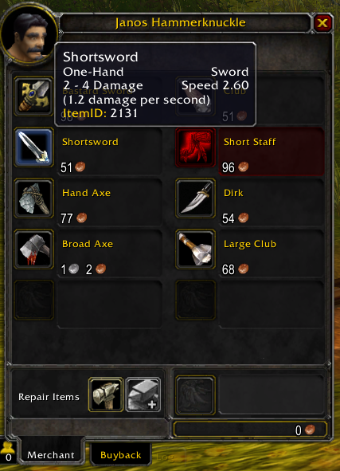
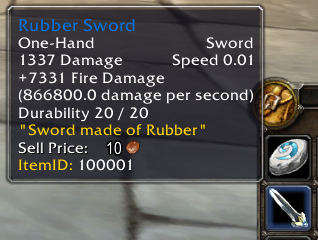
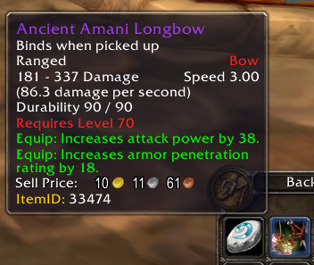

# Items and Loot

This section will be a very brief demonstration on how to create a few common item types with TSWoW and make them droppable by a creature. Creating items is typically very easy, because it's often very easy to find barebones variants you can clone from.

We will create:

- A custom sword
- Custom food (not written yet!)
- A drop quest

## Sword

Before we start, you probably want to install an addon to display ingame ItemIDs from [here](https://www.curseforge.com/wow/addons/project-3985/download/371119). It's for 3.2.0, but if you enable loading out of date addons it works fine. 



We can use the following code to create a new sword based on the one above. There isn't very much to explain here, simply write the code yourself and check out what the autocompletion API offers. Most fields should be self-explanatory at this point.

```ts
export const RUBBER_SWORD = std.Items
    .create('my-mod', 'rubber-sword-item',2131)

RUBBER_SWORD.Description.set({enGB:'Sword made of Rubber'})
RUBBER_SWORD.Quality.setBlue();
RUBBER_SWORD.Stats.addAgility(10);
// Remove old damage settings
RUBBER_SWORD.Damage.clearAll();
RUBBER_SWORD.Damage.addPhysical(1337,1337);
RUBBER_SWORD.Damage.addFire(7331,7331);
// Set the delay to 10ms. Try hitting a dummy with this
RUBBER_SWORD.Delay.set(10);
```

We can find our item by searching for its english name with the ingame command `.lookup item rubber`. We can then give ourselves this item with the command `.additem itemid`.



Notice how the delay of 10ms is displayed as a speed of 0.01. 10 milliseconds is 0.01 seconds.

### Replacing the item Model

We can easily replace the items model by copying its visual information, similar to how we can copy _spell_ visual information. To show there is very little magical about item visuals, we will use the visual from a completely different held item: the Ancient Amani Longbow.



From here, it's just two lines of code to copy the visual information:

```ts
// Load the amani longbow
const AMANI_LONGBOW = std.Items.load(33474)
// Copy all item visual information
RUBBER_SWORD.Visual.copyFrom(AMANI_LONGBOW);
```

All other weapon and armor types work more or less identical to this example, so we will not cover them further here. Of course, copying visual information from a non-held and a held equip will have nonsensical results.

## Quest Items and Loot

Drop quests aren't created much differently from a kill quest, but requires more setup. We need to create an item that will drop for us, and then define a loot table for the creature that should drop it.

Eagan Peltskinner has the first drop quest in the human starting area, [Wolves Across the Border], so we can start it and find that the dropped item is called "Diseased Wolf Pelt". If we use the ingame command `.lookup item diseased wolf` we only get a single result showing us the item id this item uses:


To create a clone of this item, we can use the following code:

```ts
// Creates a new item based on Diseased Wolf Pelt (id 50432)
const ZOMBIE_BRAIN = std.Items
    .create('my-mod','zombie-brain-item',50432);

// Changes the english display name to "Zombie Brain"
ZOMBIE_BRAIN.Name.set({enGB:'Zombie Brain'})
// Changes the displayed icon to that of a brain (finding icons is a future tutorial)
ZOMBIE_BRAIN.Visual.Icon.set('Interface\\Icons\\Spell_Shadow_Brainwash.blp')
```

### Loot Tables

There are many different loot tables in World of Warcraft. Even a single creature has separate tables for "normal" drops, skinning and pickpocketing.

Since we only want to add a quest item to a creature with an existing loot table (zombies can drop mushrooms and bags), the code to achieve this is a oneliner:

```ts
/** 
 * - Make zombie brain drop 80% of the time 
 * - Drop between 1 and 1 each time
 * - Final argument makes it only drop if we have a quest for it
 */
ZOMBIE.Loot.Normal.addItem(ZOMBIE_BRAIN.ID,80,1,1,true)
```

### Loot Quest

Now that we have created an item and added it to a loot table, all we need to do is create a quest just like we did in the previous section. 

```ts
// Create a new loot quest
const lootQuest = std.Quests
    .create('my-mod','get-their-brains')
// Require 10 zombie brains
lootQuest.Objectives.Item.add(ZOMBIE_BRAIN.ID,10)
// Make Dane Winslow the questgiver (same as before)
lootQuest.Questgiver.addBoth(6373)
lootQuest.Text.Title.enGB.set('Get their Brains');
lootQuest.Text.Objective.enGB.set('Collect 10 brains and return to Dane Winslow.');
```