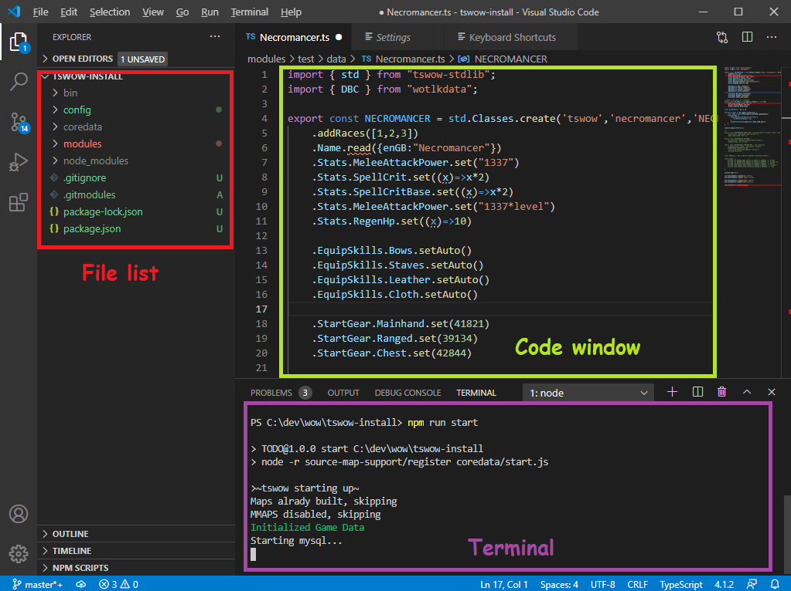
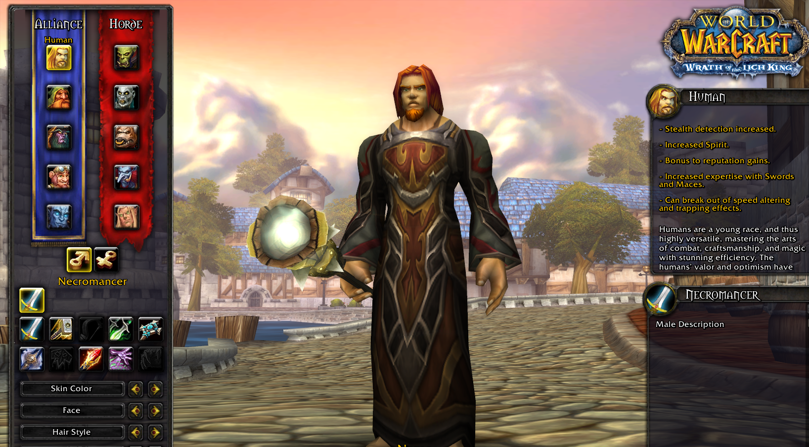
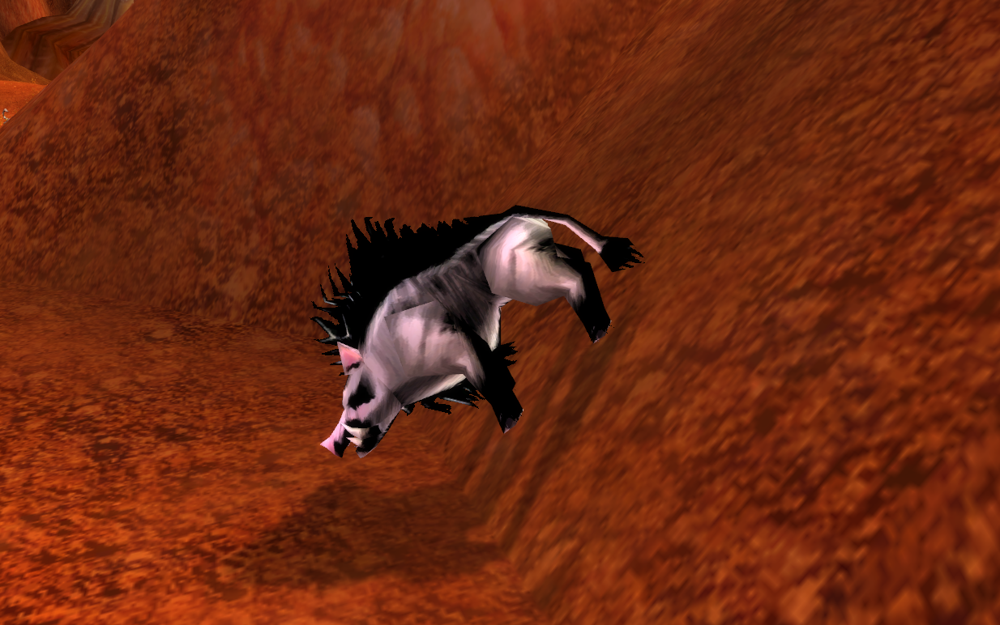

# TSWoW

With TSWoW, you use the TypeScript programming language in the VSCodium/VSCode editor to modify the games data and behavior.


_A typical TSWoW development environment_

## Module Structure
All TSWoW mods are structured as _modules_, which is a self-contained collection of scripts and game assets that modifies the game in some way. A module is a folder that lives in the `modules` subdirectory in your TSWoW installation.


**Modules directory with two modules installed**

A module in TSWoW itself can contain three types of modifications, _data_, _live scripts_ and _assets_


_Contents of a typical TSWoW module_


_Module as viewed from VSCodium_

## Data Scripts (data)

Data scripts are TypeScript code files that modify the World of Warcraft game data in some way, such as creating custom game entities (classes, items, quests etc.) or modifying existing ones. These files are run only during development to create data files for the server and client, and never when the game is actually running.

```ts
// Create a class with id "tswow:necromancer".
export const NECROMANCER = std.Classes.create('tswow','necromancer','NECROMANCER',8)
    .addRaces([1,2,3]) // Enable for humans, orcs and dwarves
    .Name.set({enGB:"Necromancer"}) 
    .Stats.SpellCrit.set((x)=>x*2) 
    .Stats.MeleeAttackPower.set("1337*level") 
    .EquipSkills.Staves.setAuto() // Enable staves at level 1
    .EquipSkills.Cloth.setAuto() // Enable cloth at level 1
```



_ Code example of a fully working custom class made with a Data Script_

## Live Scripts (scripts)

Live scripts are scripts running in the server core itself to modify how it reacts to certain events, such as a creature taking damage or a player logging in. For modding veterans, this is analogous to C++ or Eluna scripting. Live scripts are transpiled into C++ by TSWoW and can be recompiled and reloaded by the server while it's running. The TypeScript you write with Live Scripts support only a subset of the language since it's later transformed into C++, and some quirks can be slightly annoying before you get used to them.

```ts
// The main entry point a module
export function Main(events: TSEventHandlers) {
    // Register an event when a player says something
    events.Player.OnSay((player,msgType,lang,msg)=>{
        // Send a message to the player from the server
        player.SendBroadcastMessage('Hello world!');
    });
}
```


_ Code example of a Live Script _

[For those interested, the above code when transpiled to C++]()

## Assets

Assets are simply resource files such as 3D models, textures and audio. These files will be automatically loaded into the client when you run your data scripts, and can both replace existing game assets and add new ones.

_Note to veterans: To modify DBC, LUA or XML files you use data scripts and not assets._



_ Silly boar recoloring using an asset replacement _

## Summary

You have now learnt the three things you can do with TSWoW:
- Use Data Scripts to modify **game data**
- Use Assets to replace **resource files and game assets**
- Use Live scripts to **script the server**

You should now be ready to get started and [install TSWoW](2_Installation.md)