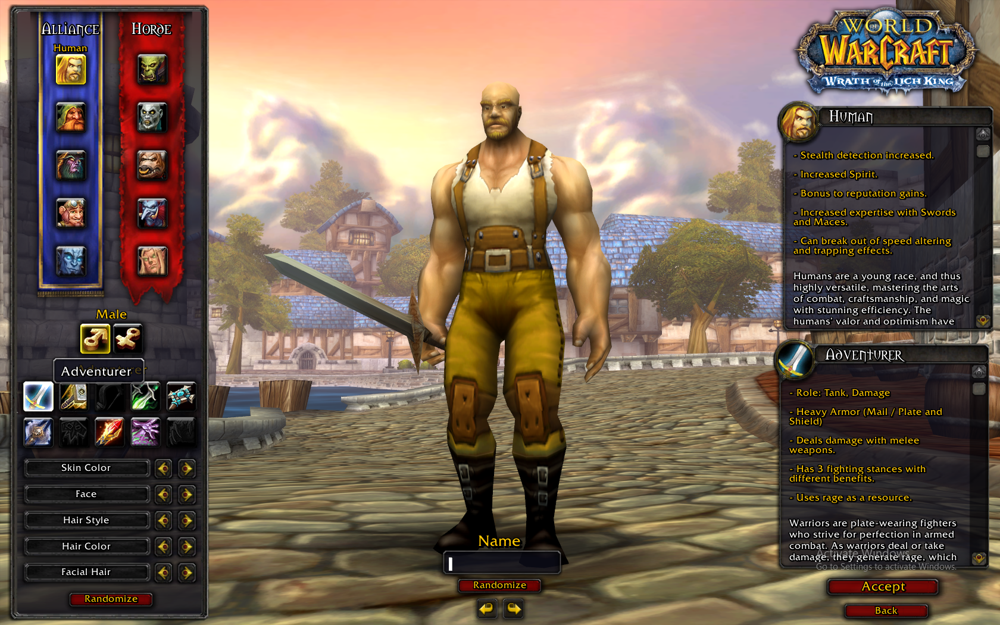
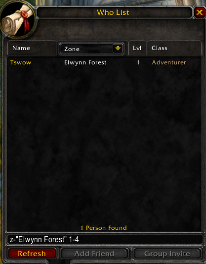
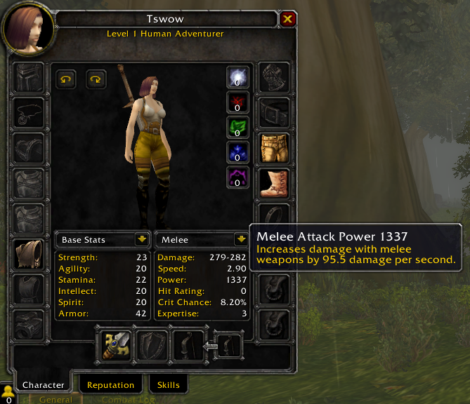
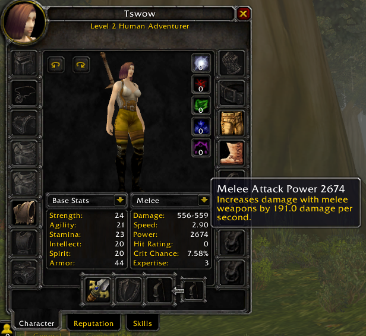

# Your First Module

[Back to Table of Contents](README.md)

In this section, we will create a basic TSWoW module and add a data script that we will compile. The purpose of this tutorial is to give you a feeling for how modding with TSWoW is like, so don't worry too much if you do not entirely understand the scripts you are asked to write yet.

You should have read the [Modding Introduction](1_ModdingIntroduction.md) and [installed TSWoW](2_Installation.md) already.

## Creating a Module

Start up your VSCodium editor in the TSWoW directory and start TSWoW from the terminal (`npm run start`).

Once TSWoW has started, type the command `module create mymodule`. This will create a new directory called _mymodule_ in your modules folder.


## Building Data Scripts

We can see that TSWoW has already created the basic mod directories for us. If we look at the `data` folder, we can see that there is a a file `mymodule-data.ts` waiting for us. This is the main entry point for your data scripts, and you should not rename it. You can create any other amount of data scripts in this and any subdirectories too, and other script files do not need to be imported by this file to work.

To build the data script we have here, type the command `check` into the TSWoW terminal. You should see output similar to the following:
```
check
Hello from mymodule data script!
```

The `check` command will run all data scripts, but won't actually write any mod data. This is useful for testing if your scripts have any issues before you run a real build, which will usually restart both the client and server.

## Client build

Replace the contents of your `mymodule-data.ts` file with the following:

```ts
import { std } from 'tswow-stdlib';

// Load the warrior class
const WARRIOR_CLASS = std.Classes.load(1)

// Change english name to "Adventurer"
WARRIOR_CLASS.Name.enGB.set('Adventurer');

// Change character creation description
WARRIOR_CLASS.UI.description.set('Adventurers adventure the world!');
```

Now that our data script actually does something, we can try it out with the `build data client` command. Since we are only changing a name, we only need to build client data to check it out. You should see output similar to the following:
```
build data client
Built SQL/DBC/MPQ data in 2.27s
```

You should also notice that TSWoW restarted the client for you in the background. If we enter the character creation screen, we can see that we have indeed changed the name of Warrior to Adventurer. 





## Server build

Let's try to make a more meaningful change to the game by changing the attack power of a warrior. Add the following to your script file: 

```ts
import { std } from 'tswow-stdlib';

// Load the warrior class
const WARRIOR_CLASS = std.Classes.load(1)

// Change english name to "Adventurer"
WARRIOR_CLASS.Name.enGB.set('Adventurer');

// Change character creation description
WARRIOR_CLASS.UI.description.set('Adventurers adventure the world!');

// Change melee attack power
WARRIOR_CLASS.Stats.MeleeAttackPower.set("level*1337");
```

For this change, it will not be sufficient to just rebuild the client because attack power is a serverside calculation. This is the case for any kind of change that is not just aesthetic. To rebuild both the client and server, you use the `build data` command. You should notice that both the client and server will restart. Log in as a warrior again and check your attack power: 




## Conclusion

In this tutorial, you have created a basic module for TSWoW and made some changes to existing game data. In the next tutorials, we will delve deeper into TSWoW data scripting by creating [our own custom class](4_CustomClass.md).
