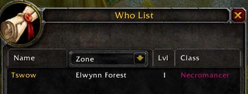

# Custom Class

[Back to Table of Contents](README.md)

This tutorial will demonstrate how to create a fully functional custom class with TSWoW. Custom classes have been a thing in WotLK for a long time, but used to be very tedious and error-prone to set up. As we will see in this tutorial, TSWoW makes creating custom classes very simple. In the next tutorials, we will also cover custom spells and trainers. 

The class we will be creating is the very same necromancer class that was shown in the [promotional video]().

_In these tutorials, you will be asked to start writing TSWoW code. It is highly recommended that you **type out** the code yourself into the editor instead of copypasting to get a feel for the autocompletion that VSCodium offers._

**We will cover the following topics:**

1. [Class Definition](#class-definition)

2. [Character Creation UI](#ui-settings)

3. [Stats](#stats)

4. [SkillLines](#skilllines)

## Class Definition
Our first task will be to create the definition for our new custom class. Create a new file called `Necromancer.ts` in your `data` mod folder. Enter the following code: 

```ts
import { std } from 'tswow-stdlib';

export const NECROMANCER_CLASS = 
    std.Classes.create('mymod','necromancer','NECROMANCER','MAGE');

NECROMANCER_CLASS.addRaces(['HUMAN','ORC','BLOODELF']);
NECROMANCER_CLASS.Name.enGB.set('Necromancer');
```

This creates a new class with the identifier "Necromancer" based off the mage class. Run the `build data` command and enter the character creation screen. You should see your new class added.


## UI Settings

Let's change the class UI color and add a proper description. Add the following to your `Necromancer.ts` file.

```ts
// Change display color
NECROMANCER_CLASS.UI.color.set(0xcc0077)

// Add character creation description
NECROMANCER_CLASS.UI.info.add('- Role: Damage, Tank')
NECROMANCER_CLASS.UI.info.add('- Light Armor (Cloth)')
NECROMANCER_CLASS.UI.info.add('- Controls multiple undead servants')
NECROMANCER_CLASS.UI.info.add('- Uses mana as a resource')
NECROMANCER_CLASS.UI.description
    .set("Necromancers are pretty cool guys. " +
        "Tehy raise the dead and doesn't afraid of anything.")
        
```


_Class descriptions added_


_Class color modified_

## Stats

Modifying stats is also very simple to do in TSWoW. The below code modifies the Melee attack power, and Spell/Melee crit of our new class. Notice how Melee attack power uses a string to represent an equation, whereas Spell/Melee crit uses callback functions. This is because those stats work very differently under the hood in World of Warcraft, and TSWoW does its best to make modifying them as similar as possible.

```ts
// Attack power = 1337*intellect
NECROMANCER_CLASS.Stats.MeleeAttackPower.set('1337*int')
// Spell Crit = 0.1*level
NECROMANCER_CLASS.Stats.SpellCrit.set((x,level)=>1337*level)
// Melee crit = 0.1*level
NECROMANCER_CLASS.Stats.MeleeCrit.set((x,level)=>1337*level)
```

## SkillLines
Classes usually have some spell types associated with them, such as Fire for mages and Assassination for rogues. A SkillLine is **not** the same thing as a talent tree, and are instead used to classify and categorize spells. SkillLines are a fairly complex topic, but just using them for class skills luckily doesn't require much more than just creating them. We will create two for our Necromancer so we can use them in the next tutorial about spells.

Add the following to the bottom of your `Necromancer.ts` to create two SkillLines for the Necromancer class:

```ts
export const NECROMANCY_SKILL = std.SkillLines
    .createClass('tswow-introduction','necromancy-skill',NECROMANCER_CLASS.ID)
NECROMANCY_SKILL.Name.enGB.set(`Necromancy`)

// Truly the epitome of creativity
export const DEATH_SKILL = std.SkillLines
    .createClass('tswow-introduction','death-skill',NECROMANCER_CLASS.ID)

DEATH_SKILL.Name.enGB.set(`Death`)
```

We won't use these until the next tutorial, so you can just leave them like this for now.

## Summary

In this tutorial, we have:

- Created a basic custom class
- Modified the character selection screen
- Modified the stats of our class
- Created SkillLines that will be used to define what spells belongs to our class.

In the next tutorial, we will [create custom spells for our new class](5_CustomSpells.md).
