# Custom Spells

[Back to Table of Contents](README.md)

Spells are probably the broadest topic in all of WoW modding. Almost every effect in the game is somehow related to spell programming, and while simple modifications are not too difficult to understand there can be a surprising amount of depth behind them.

We choose to have this topic early in the series because spells are such an important aspect that we want you to consider them while you're still fresh: If you master spells there is very little else left to scare you about WoW modding. With TSWoW, we try to make it easy to both create fairly standard spells, but also to provide better tools to investigate how more advanced spell effects can be achieved. In this tutorial we will go over the fundamental components of spells and create a few basic (but not trivial) examples, but we will also cover some methods we can use to troubleshoot and understand more advanced spell functions.

The topics we will cover are: 

1. [Basic Spell Theory](#basic-spell-theory)
2. [Death Bolt: Custom Shadow Bolt with a DoT effect](#death-bolt)
4. [Abomination: Warlock-Style Summoning](#summon-abomination)
5. [Bone Shield: Changing Resource Types](#bone-shield)

## Basic Spell Theory

This section will explain the basic components of a spell in World of Warcraft. Afterwards, our example spells will illustrate each concept in detail.

### Spell
The first building block of all spells is the spell itself. A spell is the "thing" that characters and creatures can learn and are kept in their spellbooks (but sometimes they are invisible!). Spells have a name and a numerical ID, as you can see in the screenshot below.

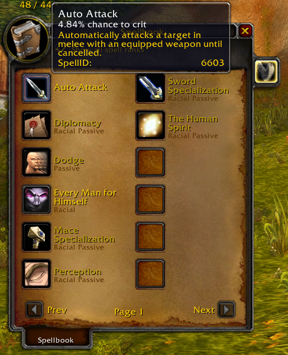

_Spells in a spellbook. Even Auto Attack is a spell, and has Spell ID 6603._

Not all spells are visible in the spellbook, and not all spells can be cast. Different **ranks** of a spell are actually just separate spells with "Rank x" as their rank names and a serverside relation that states they are ranks of another spell.

Spells have very many properties related with them, and learning about all of them will take some time even with TSWoW. A few examples include:

- Resource/mana type and cost
- Name, description, rank name
- Reagent costs
- Special flags, whether the spell is castable/passive etc.
- Icons
- Basic target type (none, ground, unit, item etc.)

### Spell Effect

To actually do something, a spell can have up to three **spell effects**. Each effect has additional individual properties, such as the _Effect Type_, damage/points applied and what type of target it has. Even though a spell can have only one type of target, its spell effects can have completely separate _implicit_ targets. For example, a spell with an AoE target can have an effect that targets the **caster** instead.

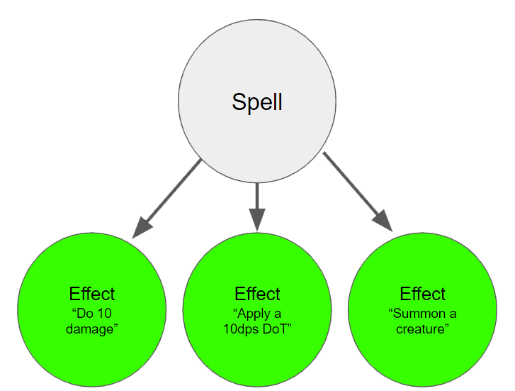

### Spell Visual

To decide how a spell looks, they have a single "Visual" component. This component is itself split up into what's called "Spell Kits". A Spell kit decides what type of models, sounds or effects should be spawned on different parts of a spell, such as the caster, target, target ground or spell missile. There are a total of **12** different spell kits, but not all spells have all kits attached. For example, a non-channeling spell wouldn't have any use for the `Channel` visual kit.

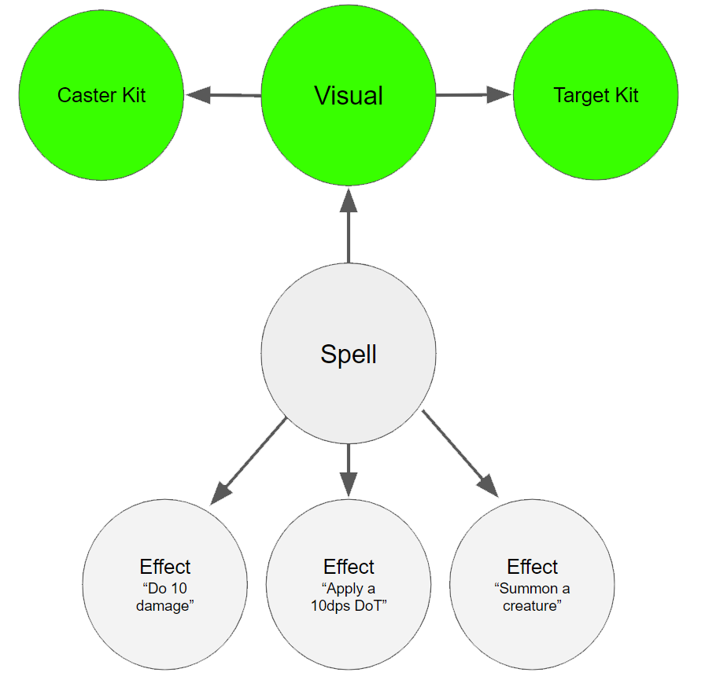


### Auras/Buffs

The technical/general name for buffs, debuff and auras in World of Warcraft is "aura". This name is used regardless of whether the effect is visible or invisible or whether it's timed or applied indefinitely like a paladin aura. **All spell effects that can be attached to a unit is an aura**.

All Aura types are pre-programmed and can be attached to units via spell effects. A single aura generally does something very simple, such as "decrease armor by _x_" or "do _x_ amount of damage every _y_ seconds". If a spell is configured to be visible, all auras that its effects have attached will be shown as a single buff or debuff icon in their respective bars.

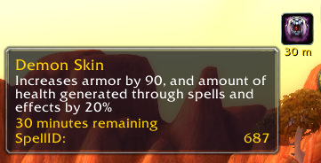  
_Demon Skin applies two auras (increase armor, increase healing done) and is shown as a single aura icon. The spell is configured to be positive (buff), to be visible, and have a duration of 30 minutes._

## Death Bolt

Now that we understand the basics of spell programming, we will create our first spell: a version of Shadow bolt that also does DoT damage. To fit with the theme, we will call it Death Bolt. 

### Creating the spell
Before we can do anything else, we will want to figure out the Spell ID of Shadow bolt. For this, we will simply create a new Warlock and check its ID. TSWoW comes bundled with an Addon that displays Spell IDs for us. 

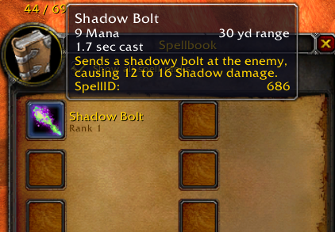

Shadow bolt has the spell ID 686, and we will use that as our "parent" spell similarly to how we used the mage class as the parent for our necromancer. Create a new file called "DeathBolt.ts" and type out the following code:

```ts
import { std } from 'tswow-stdlib';
import { DEATH_SKILL } from './Necromancer';

export const DEATH_BOLT =
    std.Spells.create('tswow-introduction','death-bolt',686)

DEATH_BOLT.Name.enGB.set('Death Bolt')
DEATH_BOLT.Description.enGB.set('A bolt of death!');
DEATH_BOLT.SkillLines.add(DEATH_SKILL.ID)
```

Build your data scripts with `bdf` and enter the game with a necromancer character. To learn this spell, we need to know its spell id. To find this, we will use the ingame command `.lookup spell death bolt`.


It turns out the ID of the new spell is 200000. To learn this spell, we can simply type `.learn 2000000`. Death Bolt should now show up in your spellbook under the Death tab, and if you cast it on a mob you will see that it behaves just like shadow bolt does.

### Changing the Spell Visual

We'd like our spell to look a little more distinct, so let's modify its spell visuals. Let's try to make it look like a bolt version of the Death Knights Death Coil spell.

First, we then need to figure out the spell ID of Death Coil. The simplest way is to create a Death Knight character and check it just like we did with Shadow Bolt.

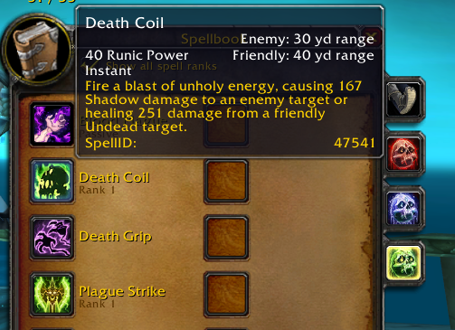

Its spell ID is 47541, which is all we need to steal its models and special effects. Add the following to `DeathBolt.ts`: 

```ts
// Copy the missile model
DEATH_BOLT.Visual.MissileModel.set(DEATH_COIL.Visual.MissileModel.get())

// Copy the impact visual kit
DEATH_BOLT.Visual.Kits.Impact.cloneFrom(DEATH_COIL.Visual.Kits.Impact)
```

Since we only modified visual information, we can rebuild using `bdc` and should see that we have indeed replaced the missile model and impact kit with that of Death Coil. We can also see that the casting animation and effect is still left from Shadow Bolt. This is because we did not replace or modify the `Cast` kit.

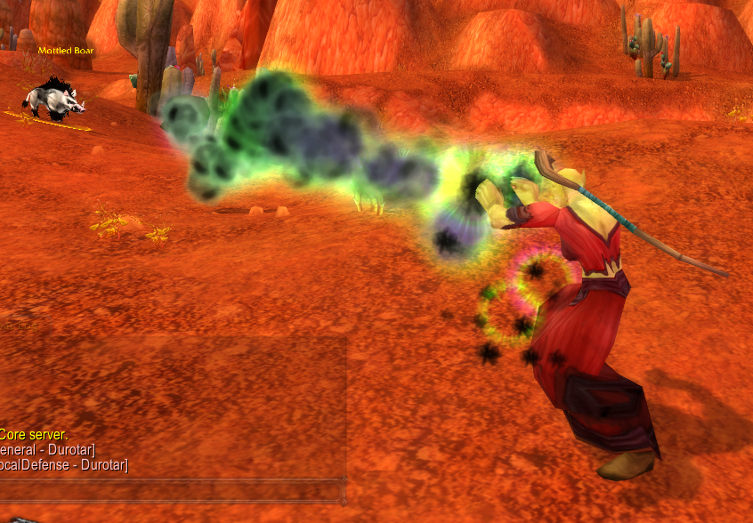

### Applying a DoT effect

Now we want to apply a DoT effect on Death Bolt. Doing this manually seems scary, so we might want to try copying it from another spell just like we copied the visual data from death coil. Since we already deal with warlock spells, we could try to steal the effect from **Corruption**. 

This spell is not instantly available when we create a warlock character, so to easily get access to it we can level up our character to 5 and learn all trainer spells with the commands `.levelup 5` and `.learn my trainer`. We learn that the spell ID of corruption is 172.

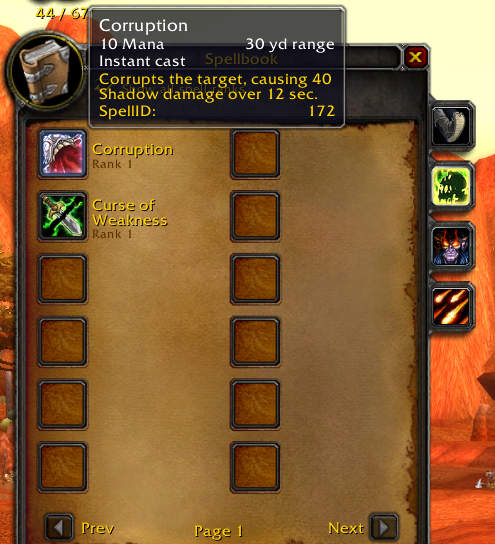

Now, we can try to add the following code to `DeathBolt.ts` and rebuild using `bdf`. 

```ts
const CORRUPTION = std.Spells.load(172)

// Copy the first effect in corruption to a new effect slot
DEATH_BOLT.Effects.add().copyFrom(CORRUPTION.Effects.get(0))
```

However, when we try this new spell it we will find that it does not apply a DoT on the target. What do we do now?

For situations like these, all TSWoW entities have a function called 'objectify', that we can print out to see how its attributes look. Objectify will attempt to translate the complex underlying structure that you are modifying to a single JavaScript object that is friendly for printing. 

Add the following line to the bottom of your program and run the `check` command to see how the attributes look for corruption:

```ts
console.log(CORRUPTION.objectify());
```

The output is quite a lot of text and will take some time to go through, but we can actually see that Corruption indeed has two separate spell effects.

```js
  Effects: [
    {
      Radius: [Object],
      ItemType: 0,
      AuraType: 'PeriodicDamage', // <-- Looks promising
      EffectType: 'ApplyAura',
      Mechanic: 'None',
...
```

```js
      Radius: [Object],
      ItemType: 0,
      AuraType: 'None',
      EffectType: 'Dummy',
      Mechanic: 'None',
```

However, it seems that it is indeed the first effect that applies the periodic damage aura, so we probably have something else wrong. It is also possible there is something to DoTs we don't quite understand yet and that it's just not possible to clone them from other spells like this. Let's look through the rest of the objectify output anyways to see if there's anything else we might have missed.

Right at the top is a line that might look promising: 

```js
  Attributes: [ 'notShapeshifted', 'unk82' ],
```

It seems that corruption has a weird flag called "unk82" set, so maybe we can just set that attribute and the DoT will work in our spell? Add the following code to your death bolt script. Notice how we can easily find that "unk82" is a valid attribute with the help of autocompletion.

```
DEATH_BOLT.Attributes.unk82.mark();
```

Rebuild your script and again, nothing. This is where we might just want to give up or ask someone else for help. We might also start thinking about what is actually necessary for a DoT to work. What we may come to realize is that spells can have multiple auras applied, but a buff icon only has one **duration**, so that must mean that "duration" is not a property of spell effects, but of the spell itself! If we search the objectify output for "duration", we indeed find this line: 

```js
  Duration: { Duration: 12000, DurationPerLevel: 0, MaxDuration: 12000 },
```

By using autocomplete, we can now easily find that we can also set this property for death bolt by adding the following code to the bottom of our spell script:

```ts
DEATH_BOLT.Duration.set(12000,0,12000)
```

Rebuild the script and bingo, that was it! When we cast death bolt we now see a debuff icon showing up on our target, and we can see that it also deals periodic damage!

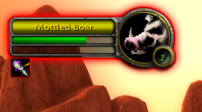

To add a description to the buff Icon, we can (with the help of autocomplete), find that there exists a property called `AuraDescription` on the spell that works just like a normal description. Our final program for the Death Bolt spell becomes: 

```ts
import { std } from 'tswow-stdlib';

export const DEATH_BOLT =
    std.Spells.create('tswow-introduction','death-bolt',686)
DEATH_BOLT.Name.enGB.set('Death Bolt')
DEATH_BOLT.Description.enGB.set('A bolt of Death!');

const DEATH_COIL = std.Spells.load(47541)

// Copy the missile model
DEATH_BOLT.Visual.MissileModel.set(DEATH_COIL.Visual.MissileModel.get())

// Copy the impact visual kit
DEATH_BOLT.Visual.Kits.Impact.cloneFrom(DEATH_COIL.Visual.Kits.Impact)

const CORRUPTION = std.Spells.load(172)

// Copy the first effect in corruption to a new effect slot
DEATH_BOLT.Effects.add().copyFrom(CORRUPTION.Effects.get(0))

// Weird attribute that corruption had set
DEATH_BOLT.Attributes.unk82.mark();

// The duration of our DoT
DEATH_BOLT.Duration.set(12000,0,12000)

// Buff icon description
DEATH_BOLT.AuraDescription.enGB.set('Deals periodic damage.');
```

### Summary

In this section, we have learnt:
- How to create a spell based on another spell
- That we can borrow visual effects from other spells
- That we can borrow spell effects from other spells
- That we can use VSCodiums autocomplete to find out what fields we can change.
- That if we get stuck, we can try to `objectify()` and print our data objects to see if there is something we might have missed.

These methods go a long way to let you create many of the standard spell effects in WoW. However, sometimes even this is not enough. Some spells have such bizarre settings that it's almost impossible to understand them, some spell effects are just impossible to combine, and as we mentioned before even some aren't even possible to implement without serverside `live scripting`. Luckily for us, TSWoW has live scripting implemented, but that is out of scope of this basic tutorial. 

Some additional suggestions for what you can try to modify with Death Bolt yourself, using autocomplete to navigate the data structure:

- Change the icon
- Change the amount of direct damage from the bolt
- Change the amount of damage done by the DoT
- Add yet another DoT effect that targets the caster instead (Advanced)

## Summon Abomination

Our next task is to make a spell to summon an abomination. Like we have now learnt, the first step in creating almost any type of spell is to find the most similar spell and just clone it. Let's use the warlocks summon imp spell, which has ID 688.

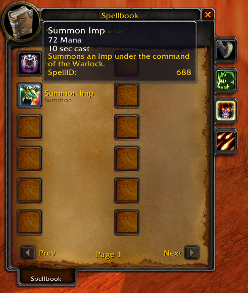


Create a new file called `SummonAbomination.ts` and type the following code:

```ts
import { std } from 'tswow-stdlib';

export const SUMMON_ABOMINATION = std.Spells.create('tswow-introduction','summon-abomination', 688)

SUMMON_ABOMINATION.Name.enGB.set('Summon Abomination');
```

If we rebuild, learn the new spell and cast it (`.lookup spell summon abomination`, then `.learn` the ID we find), we should see that we successfully summon an imp despite that we're not a warlock. But an imp was not what we wanted to summon, so we need to figure out how to change the creature that is summoned. While our imp is summoned, we can target it and use the `.id` ingame command to learn its creature ID (416): 

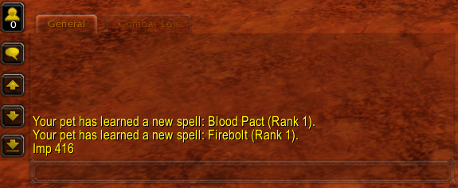

Now, we will again do what we did with Death Bolt when we weren't sure what to do: we `objectify()` it and see what we can find. If there is any reference to 416 that's probably something we want to try. Indeed, our first and only spell effect has the following:

```ts
  Effects: [
    {
      Radius: [Object],
      ItemType: 0,
      AuraType: 'None',
      EffectType: 'SummonPet',
      Mechanic: 'None',
      BasePoints: -1,
      DieSides: 1,
      PointsPerLevel: 0,
      PointsPerCombo: 0,
      ImplicitTargetA: 32,
      ImplicitTargetB: 0,
      AuraPeriod: 0,
      MultipleValue: 0,
      ChainTarget: 0,
      MiscValueA: 416, // <-- Just what we wanted
      MiscValueB: 0,
      TriggerSpell: 0,
      ChainAmplitude: 1,
      ClassMask: [Object]
    }
  ],
```

Now, we would need another creature ID to try if we can replace it. Since you already learnt how to use the `.id` command, I will save you the hassle of finding an abomination to check and give you that creature ID 8543 is an abomination. We get the following code: 

```ts
import { std } from 'tswow-stdlib';

export const SUMMON_ABOMINATION = std.Spells.create('tswow-introduction','summon-abomination', 688)
SUMMON_ABOMINATION.Name.enGB.set('Summon Abomination');
SUMMON_ABOMINATION.Effects.get(0).MiscValueA.set(8543);
```

Ta-da! If we rebuild with `bdf` and again try our spell we see that we have successfully summoned an abomination:


## Bone Shield
After all that troubleshooting, I think we need to finish with something simple. To make our necromancer look a bit more like the job, let's give them those bone shields that death knights have. Since death knights use runic power, we will need to change the resource type so it instead uses mana. 

As usual, we create a death knight character to find this spell. Bone Shield is a talent in the unholy tree, but luckily it seems that our SpellID addon can identify the spell id directly from the talent tab. In the next tutorial, we will explain why this is, but for now it is enough that we get the ID.


We can create this spell just like we have with the others, but as we start to look through the autocomplete options we might not find anything relating to mana or spell resources. Didn't we just promise no troubleshooting?

It turns out that "spell resources" is called "Power" in World of Warcraft (not to be confused with _Spell Power_), and the following code will successfully change bone shields resource type to use mana instead:

```ts
import { std } from "tswow-stdlib";

export const BONE_SHIELD = 
    std.Spells.create('tswow-introduction','boneshield',49222)
BONE_SHIELD.Power.setMana(1337);
```

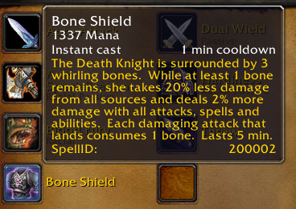

Some things for you to try out yourself:

- 3 hits isn't very much for the protective spell of a caster class, try to increase the stacks to something higher.

- 20% bonus is a very high damage reduction if you have a lot of stacks. Try to reduce this amount to something lower.

- Bone Shield is very similar to the priest spell `Inner Fire`. Try to copy the functionality of Inner Fire over to this Bone shield and see if you can get it to also increase your armor while active.


## Conclusion

This has been a long tutorial with a lot of theory and troubleshooting. TSWoW tries its best to make spell creation easier than it used to be, but spells are just fundamentally complicated and it's impossible to make a single API that makes creating every kind of spell easy. Our aim is instead to teach you how to _think_ like a reverse engineer yourself, and to fill this wiki with plenty of code examples if you get stuck.

In the next tutorial, we will [create Talents for our class and spells](6_CustomTalents.md)
