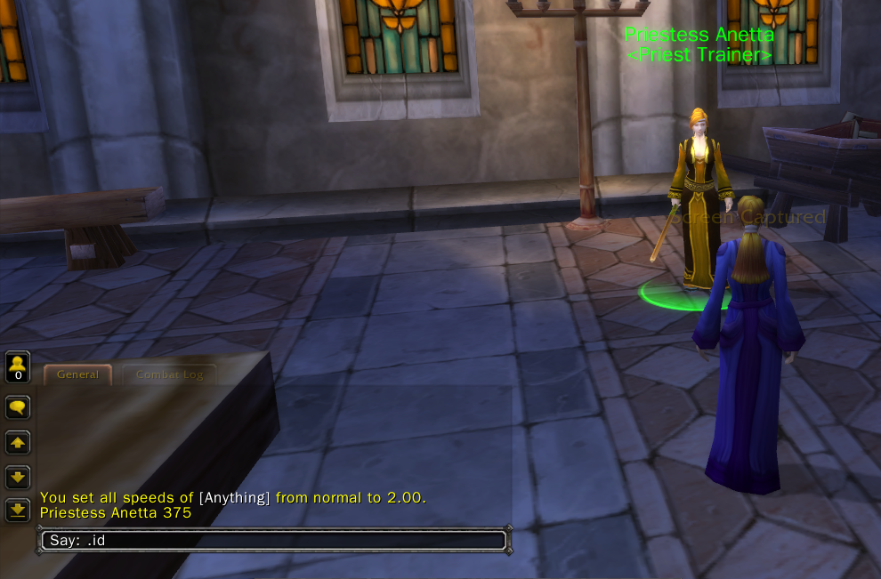
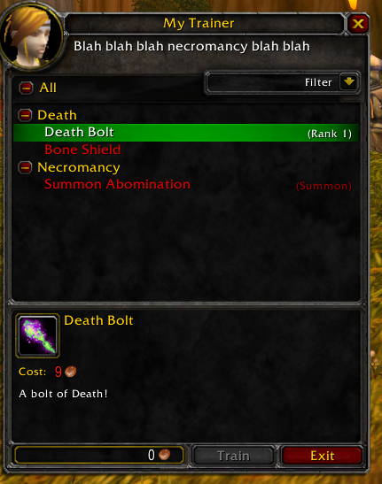

# Custom Trainer

[Back to Table of Contents](README.md)

This tutorial will be a brief introduction to how Creatures and NPCs work in World of Warcraft, and we will create a trainer for the Necromancer spells we created earlier. Creature theory is much simpler than Spell theory, so this is a much easier section than the spell tutorial.

## Creatures

In World of Warcraft, the things that you as a player can select (which shows a portrait when you do) are known as `Units`. Both Players and non-player characters are Units. Non-player characters are called `Creatures`, even if they are humanoid and friendly to the player. When we create custom Creatures, we define what we call a `Creature Template`, which is a common type that many specific creatures in the game can share. For example, all the wolves in Northshire Abbey share a single creature template. From the Creature Template we can then spawn `Creature Instances`, that correspond to the individual entities you see in the game.

### Creating a Trainer NPC

The first step of creating a creature is the exact same as when creating a spell: find the thing that most closely resembles what you're trying to create and clone it. We want a type of trainer, so let's use the priest trainer in Northshire Abbey for our necromancer trainer: 



To create a new creature, create a new file `Trainer.ts` and type the following code:

```ts
import { std } from "tswow-stdlib";

export const NECROMANCY_TRAINER_HUMAN = 
    std.CreatureTemplates.create('tswow-introduction','necromancer-trainer',375)

NECROMANCY_TRAINER_HUMAN.Name.enGB.set('My Trainer');
NECROMANCY_TRAINER_HUMAN.Title.enGB.set('Necromancy Trainer')
```

Rebuild the code using `bdf` and log in as a human. We can find the ID of our new creature by using the ingame command `.lookup creature my trainer`. Then, we can spawn this creature at the players current location using `.npc add creatureid`. 

### Adding Trainer Data

You might notice that this trainer does nothing to us, even if we talked to it as a mage. For trainers, we need to add individual training data to each trainer we have. Let's set up the trainer to work with the necromancer class and add a few spells:

```ts
// The text displayed at the top of the trainer window
NECROMANCY_TRAINER_HUMAN.Trainer.Greeting.enGB.set(`Blah blah blah necromancy blah blah`)

// Set the trainer class to necromancer
NECROMANCY_TRAINER_HUMAN.Trainer.Class.set(NECROMANCER_CLASS.ID);

// Need to disable gossip text to make trainer work for our new class
NECROMANCY_TRAINER_HUMAN.GossipID.set(0);

// Because of how Trainers work, trainer data is not copied over from the last creature
NECROMANCY_TRAINER_HUMAN.Trainer.addSpell(DEATH_BOLT.ID,10,0,DEATH_SKILL.ID);
NECROMANCY_TRAINER_HUMAN.Trainer.addSpell(SUMMON_ABOMINATION.ID,10,5,NECROMANCY_SKILL.ID);
NECROMANCY_TRAINER_HUMAN.Trainer.addSpell(BONE_SHIELD.ID,10,10,NECROMANCY_SKILL.ID);
```

Opening this trainer as the necromancer class should show that we have successfully added all the spells to it.



### Spawning creatures from a script

We really don't want to have to manually `.npc add` our creatures into the world, because the TSWoW way is to always write all game data as data scripts. 

To add our creature from a script, we need a way to figure out **where** to place it. For this, TSWoW has a special command to print out the players current position to a file where we can easily copy it from.

Find a suitable location for your npc (use `.npc delete` on the old one if you want to re-use their location), make sure your character is facing the way you want the npc to, and then type the ingame command `.at`. You should see output similar to the following:


Instead of copying this manually, TSWoW has created a special file called `positions.txt` in the installation folder. To easily open it inside VSCodium, press `Ctrl+p` and type "positions.txt", then select the file and open it.

Now, all we have to do to spawn our new creature is to add the following code to the bottom of our `Trainer.ts` file, importing any dependencies like before: 

```ts
NECROMANCY_TRAINER_HUMAN
    .spawn('tswow-introduction','trainer-instance',Pos(0,-8898.656250,-130.632767,81.285889,1.766019))
```

Rebuild the game using `.bdf` and log in again at this location. You should see your custom npc standing there, without needing to manually spawn it with `.npc add`.

## Summary
In this tutorial, you have learnt the basics of how creatures work in World of Warcraft and created a simple trainer NPC. This concludes the first half of our TSWoW introduction, which dealt with classes and spells. The next half will continue to work with Creatures, and will also discuss Items, Quests and Scripting.
